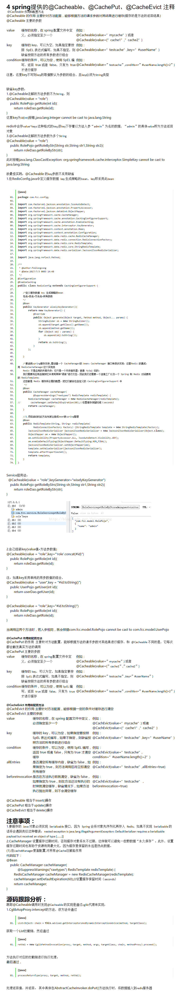

# spring boot 集成 redis 缓存

## 添加依赖

```
<dependency>
    <groupId>org.springframework.boot</groupId>
    <artifactId>spring-boot-starter-data-redis</artifactId>
</dependency>

```


## 添加redis配置

```

# Redis数据库索引（默认为0）
spring.redis.database=0
# Redis服务器地址
spring.redis.host=127.0.0.1
# Redis服务器连接端口
spring.redis.port=6379
# Redis服务器连接密码（默认为空）
spring.redis.password=
# 连接池最大连接数（使用负值表示没有限制）
spring.redis.pool.max-active=8
# 连接池最大阻塞等待时间（使用负值表示没有限制）
spring.redis.pool.max-wait=-1
# 连接池中的最大空闲连接
spring.redis.pool.max-idle=8
# 连接池中的最小空闲连接
spring.redis.pool.min-idle=0
# 连接超时时间（毫秒）
spring.redis.timeout=0

```


## 在启动类，增加注解@EnableCaching，开启缓存功能

```
@SpringBootApplication
@EnableCaching
public class App {
    public static void main(String[] args) {
        SpringApplication.run(App.class, args);
    }
}
```

## 添加 RedisConfiguration 配置

具体见 com.zsx.config.RedisConfiguration 类

## 使用注解来


---

- @Cacheable(key ="#p0")

@Cacheable将查询结果缓存到redis中，（key="#p0"）指定传入的第一个参数作为redis的key。

- @CachePut(key = "#p0")

update操作时，使用该注解，@CachePut，指定key，将更新的结果同步到redis中

- @CacheEvict(key ="#p0",allEntries=true)

删除操作使用该注解，@CacheEvict，指定key，删除缓存数据，allEntries=true,方法调用后将立即清除缓存

- @Cacheable(cacheNames = "user", key = "'getAll'")

对于不使用全局的key生成策略，直接使用一个字符串key的情况，需要加一个cacheNames，（*也可以在类上加@CacheConfig(cacheNames = "user")来指定这个类使用的cacheName*），这个无特殊要求，跟业务符合即可，。
**注意，key的值要用单引号包括起来**


## 其它参考




---
