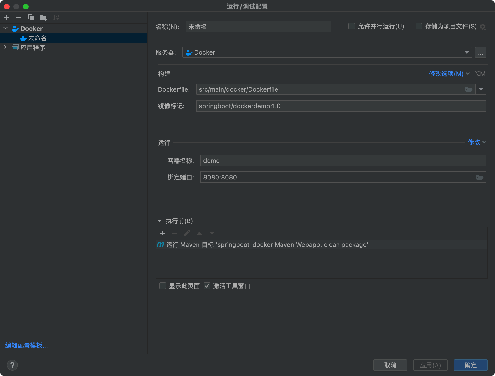

# springBoot集成Docker


## pom添加docker插件


```xml
<plugin>
    <groupId>com.spotify</groupId>
    <artifactId>docker-maven-plugin</artifactId>
    <version>0.4.13</version>
    <configuration>
        <imageName>${docker.image.prefix}/${project.artifactId}</imageName>
        <dockerDirectory>src/main/docker</dockerDirectory>
        <resources>
            <resource>
                <targetPath>/</targetPath>
                <directory>${project.build.directory}</directory>
                <include>${project.build.finalName}.jar</include>
            </resource>
        </resources>
    </configuration>
</plugin>

<plugin>
<artifactId>maven-antrun-plugin</artifactId>
<executions>
    <execution>
        <phase>package</phase>
        <configuration>
            <tasks>
                <copy todir="src/main/docker" file="target/${project.artifactId}-${project.version}.${project.packaging}"></copy>
            </tasks>
        </configuration>
        <goals>
            <goal>run</goal>
        </goals>
    </execution>
</executions>
</plugin>
```

配置打包名称

```xml
<finalName>${project.artifactId}-${project.version}</finalName>
```


## 编写dockerfile

```
FROM openjdk:8-jdk-alpine

VOLUME /tmp

ADD *.jar app.jar

ENTRYPOINT ["java","-Djava.security.egd=file:/dev/./urandom","-jar","/app.jar"]

EXPOSE 8080
```

## 配置docker运行




## 启动容器
docker run -p 8080:8080 -t springboot-docker-demo/springboot-docker-build


## 访问
http://localhost:8080


